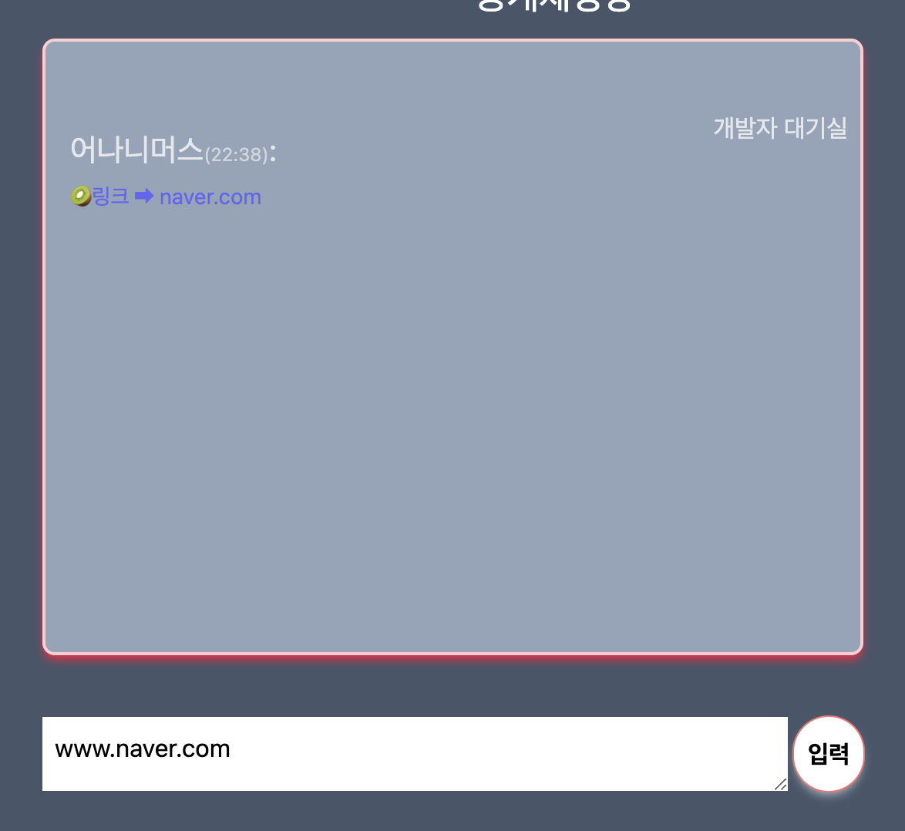

# 두 번째 개인제작 라이브러리: RS_Chat


## 훅을 통한 간단한 서버 - 클라이언트의 웹소켓 통신
### Version 0.0.1


```ts
import { useCallback, useContext, useEffect, useState } from 'react';
import SockJS from 'sockjs-client';
import {Client, StompSubscription} from '@stomp/stompjs';
import UserContext from '../context/UserContext';

interface Props {
  serverPath: string;
  clientPath: string;
  excuteBeforeComponentMount: (() => void)[];
}
export interface Message {
  username: string;
  content: string;
  date: string;
  to?: string;
  from?: string;
} 
interface PublishConfig<T> {
  destination: string;
  body: T ;
  headers?: Record<string, string>;
}

interface User {
  name: string;
  token: string;
}

type Subscribe = (path:string, callback:() => void) => void;
type Publish = <T>({destination, body, headers}:PublishConfig<T>) => void;

let socket: Client;

const subscriptions: Record<string,StompSubscription> = {};

function useSocket({serverPath, clientPath, excuteBeforeComponentMount}:Props) {
  const { chatToken } = useContext(UserContext);
  const [chat, setChat] = useState<Message[]>([]);
  const [userList, setUserList] = useState<User[]>([]);
  const [totalNum, setTotalNum] = useState(0);
  
  const clearChat = useCallback(() => {
    setChat([]);
  },[])
  
  const generateSocket = (token:string) => {
    
    socket = new Client({
      
      // 사용자가 url 입력할 수 있게끔 수정 필요
      webSocketFactory: () => new SockJS('http://192.168.219.110:8080/ws'),
      // 사용자의 디버깅 요청에 따라 바뀔 수 있게 수정 필요
      // debug: (str) => {
      //   console.log(str)
      // },
      // 사용자의 원하는 커스텀 해더 가능하게 수정 필요
      connectHeaders: {
        login: token,
        passcode: token,
        something: 'anything'
      },
      // 사용자가 원하는 시간대로 변할 수 있게끔 수정 필요
      reconnectDelay: 5000,
      heartbeatIncoming: 3000,
      heartbeatOutgoing: 30000,
    })
    socket.onConnect = (frame) => {

      socket.subscribe(serverPath,(message) => {
        const payload = JSON.parse(message.body);
        if(payload.username) setChat((prev) => [...prev, {content:payload.content, username:payload.username, date:payload.date}]);
      });
      
      socket.subscribe(`${serverPath}/join`,(message) => {
        setUserList(Object.values(JSON.parse(message.body)));
      });

      socket.subscribe(`${serverPath}/userlist`,(message) => {
        setUserList(Object.values(JSON.parse(message.body)));
      });

      
      socket.subscribe(`${serverPath}/infoMessage`,(message) => {
        
        const payload = JSON.parse(message.body);
        setUserList((prev) => prev.filter((user) => user !== payload.prevUser));
      });
  
      // 접속한 유저 수 채널
      socket.subscribe(`${serverPath}/usercount`,(message) => {
        const payload = JSON.parse(message.body);
        setTotalNum(payload);
      });

      // 유저 연결 해제 채널
      socket.subscribe(`${serverPath}/disconnect`,(message) => {
        const payload = JSON.parse(message.body);
        setUserList(payload);
      });

      // 귓속말 구독 채널
      socket.subscribe(`/queue/whisper`, (message) => {
        const payload = JSON.parse(message.body);
      });

      excuteBeforeComponentMount && excuteBeforeComponentMount.forEach((callback) => callback());
    }
  }

  const connect = useCallback((ct:string) => {
    generateSocket(ct);
    socket.activate();
  },[])

  
  const subscribe:Subscribe = useCallback((path,callback) => {
    if(!socket || subscriptions[path]) return;
    callback();
    subscriptions[path] = socket.subscribe(path, callback);
  },[]);

  const publish:Publish = useCallback(({destination, body, headers}) => {
    if(!socket) return;
    socket.publish({
      destination,
      body : typeof body === 'string'
            ? body 
            : JSON.stringify(body),
      headers
    });
  },[])


  useEffect(() => {
    if(!chatToken) return
      connect(chatToken);
  },[chatToken]);

  return {subscribe,publish, chat, userList, totalNum, clearChat}
}

export default useSocket
```


## 내장기능

- public chat
- connect / disconnect chat
- check userlist
- infomation chat
- check usercount in separate chatroom
- whisper
- convert Link from chatting

